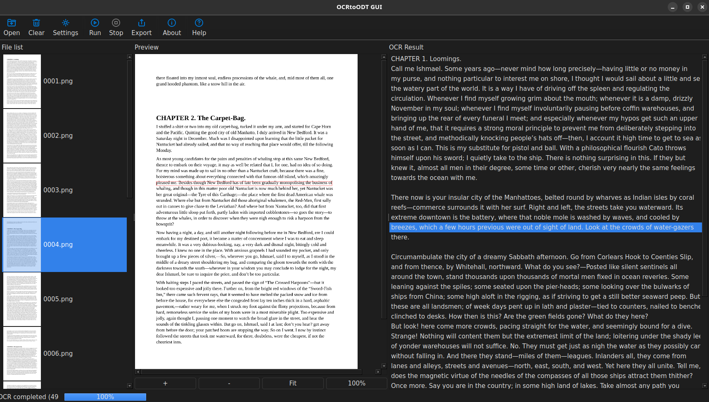
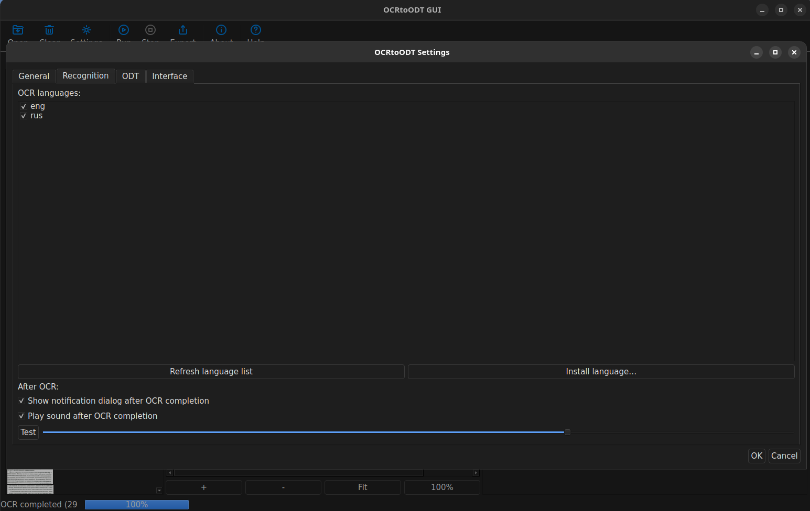

# OCRtoODT

**Structured OCR for PDFs & images → export to ODT / TXT / DOCX (deterministic pipeline, Qt6 desktop app).**

**Best for:** archival scanning, research/legal OCR, reproducible extraction, audit-friendly workflows.  
**Not a text editor:** it’s an inspectable OCR pipeline (Input → Preprocess → OCR → Structuring → Export).

**Download (AppImage):** [https://github.com/Rostislav62/OCRtoODT-Qt/releases/latest](https://github.com/Rostislav62/OCRtoODT-Qt/releases/latest)

```
chmod +x OCRtoODT-\*.AppImage  
./OCRtoODT-\*.AppImage
```

**What you get:**

- multipass Tesseract OCR with scoring

- OpenCV preprocessing stage

- structured output + exports (ODT/TXT/DOCX)

- config-driven (`config.yaml`) + detailed logs

**Security / trust:** Starting with v3.0.6, releases include SHA256SUMS checksums.


## What OCRtoODT is (and isn’t)

**OCRtoODT is:**

- a deterministic OCR **processing engine** with a visible pipeline and reproducible results

- designed for structured extraction (TSV → LineTable → export)

- configuration-driven (`config.yaml`) with detailed logging

**OCRtoODT is not:**

- a text editor / word processor

- a “magic cleanup” OCR tool that silently rewrites your text


## Screenshots





More screenshots: see `docs/` 

## Quick start (typical workflow)

1. Open a PDF or images

2. Run the pipeline (Preprocess → OCR → Structuring)

3. Inspect structured text

4. Export to ODT/TXT/DOCX


## Troubleshooting (common)

- **AppImage won’t start:** ensure it’s executable (`chmod +x ...`) and run from terminal to see errors.

- **Wayland issues:** try launching under X11 (desktop setting) or run from terminal to confirm plugin output.

- **No OCR languages / wrong language:** check `config.yaml` OCR language settings (and installed tessdata if applicable).


## Project status

- Linux AppImage releases are the primary distribution channel today.

- Packaging targets (planned): Flatpak (Flathub), Snap.


## Links

- **Releases (AppImage):** [https://github.com/Rostislav62/OCRtoODT-Qt/releases](https://github.com/Rostislav62/OCRtoODT-Qt/releases)
- **Issues / bug reports:** [https://github.com/Rostislav62/OCRtoODT-Qt/issues](https://github.com/Rostislav62/OCRtoODT-Qt/issues)
- **License (MIT):** see `LICENSE`
- **Security:** SECURITY.md
- **Support:** SUPPORT.md
- **Third-party notices:** THIRD_PARTY_NOTICES.md

## Developer & packaging documentation

This README is intentionally user-focused.

For technical details, see:

- **Project overview / architecture:** `docs/README\_DEVELOPER.md` 
- **Build from source:** `docs/BUILD.md`
- **Release process (AppImage):** `docs/RELEASING\_APPIMAGE.md`
- **Packaging plans:** `docs/DISTRIBUTION.md`

