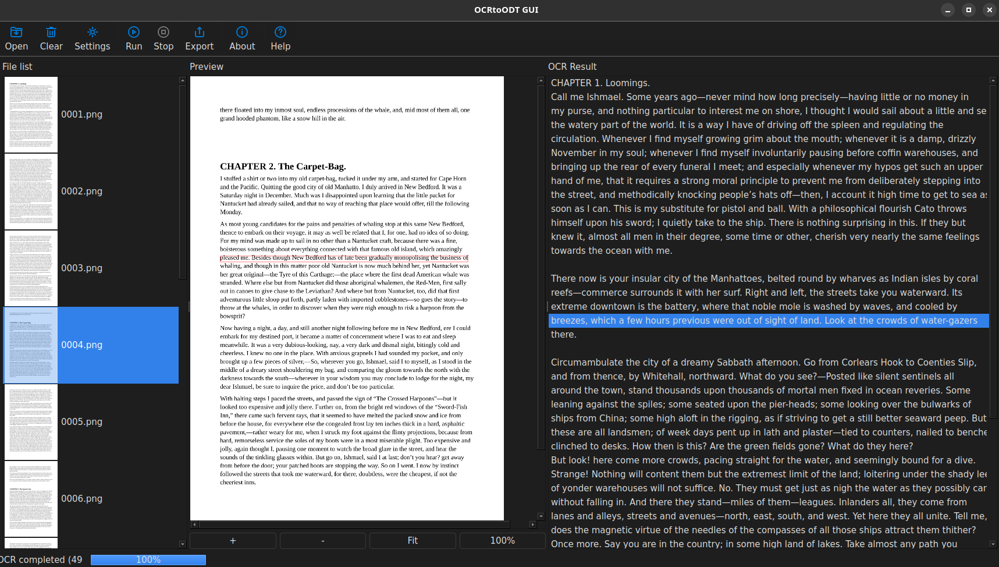
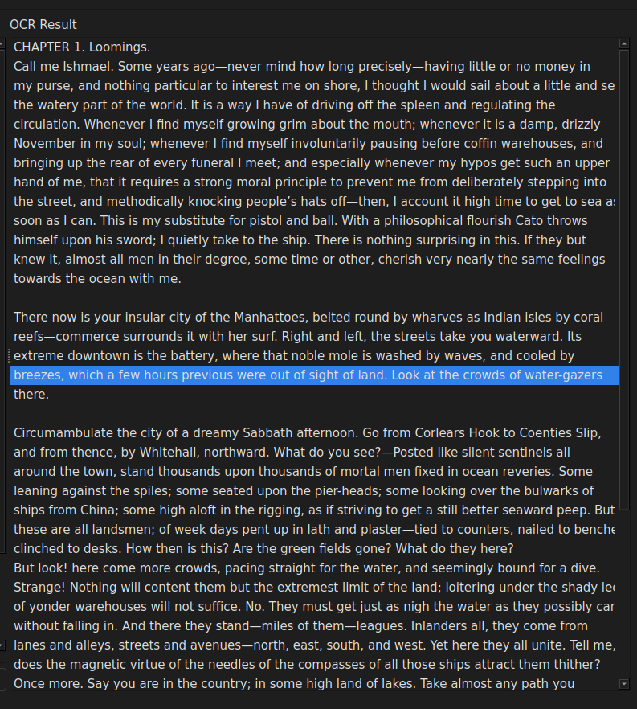
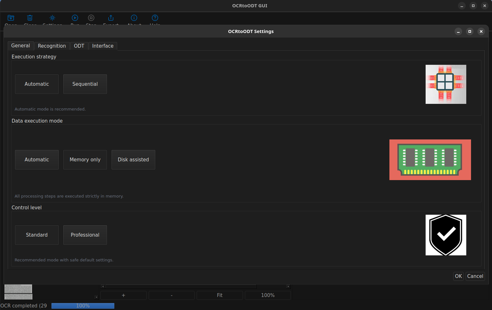
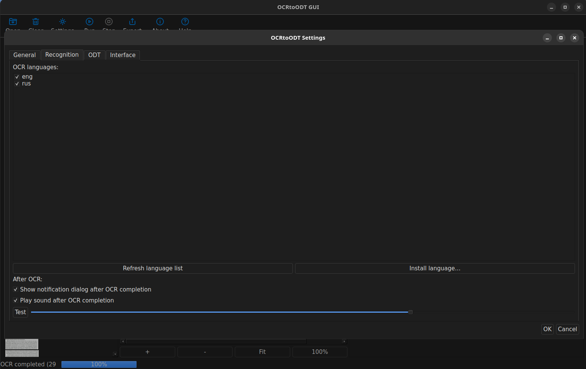
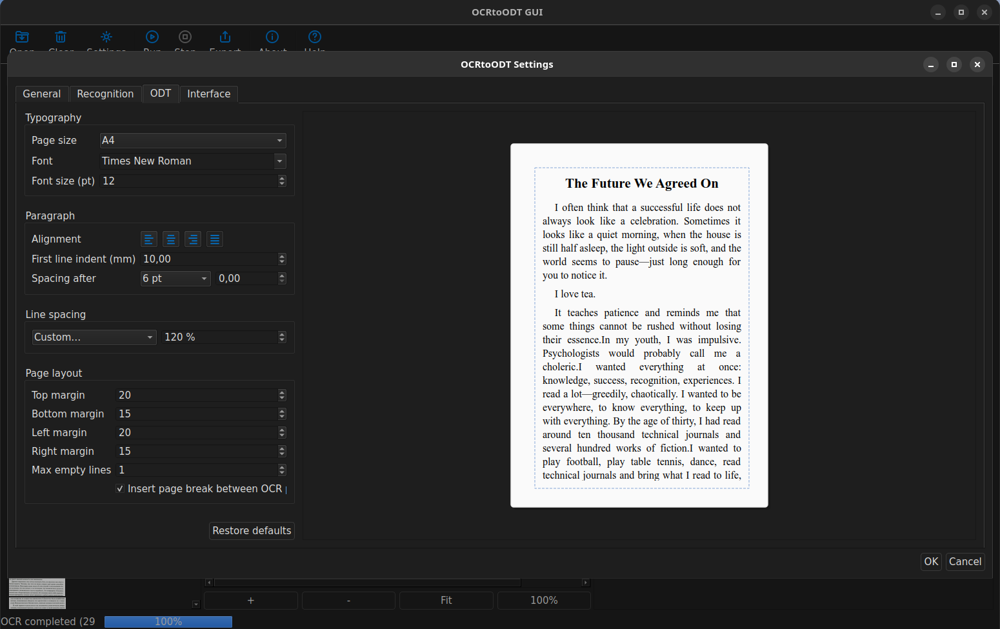
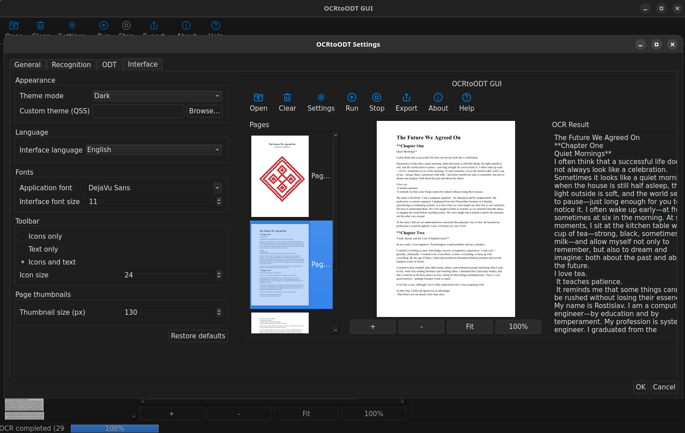

# **🧠 OCRtoODT**

## **Structured OCR Extraction & Deterministic Processing Engine**

  

  
  
  
  
  

## **📌 Overview**

**OCRtoODT** is a professional-grade, structured OCR extraction system built in modern C++ (Qt 6).

It is not a text editor.  
 It is not a word processor.

It is a **deterministic, inspectable OCR data pipeline** designed for:

- archival digitization

- research workflows

- legal and academic OCR

- structured document processing

- reproducible OCR experiments

The focus is on:

- structural correctness

- predictable multi-stage processing

- RAM-first execution

- full traceability

# **🎯 Philosophy**

Structure first. Formatting later.

OCRtoODT preserves raw OCR results and transforms them into structured representations without hidden modifications.

The application guarantees:

- deterministic pipeline execution

- no silent post-processing distortion

- explicit configuration control

- isolated stage responsibilities

# **🏗 Processing Pipeline**

OCRtoODT is built as a strict stage-based engine:

STEP 0 → Input

STEP 1 → Preprocess

STEP 2 → OCR

STEP 3 → TSV Structuring

STEP 4 → UI Synchronization

STEP 5 → Export

Each stage:

- has a defined contract

- produces predictable output

- does not access UI logic

- avoids ownership violations

## **🔹 STEP 0 — Input**

- PDF loading (Poppler-Qt6)

- Raster image import (PNG, JPEG, TIFF)

- Page expansion

- Thumbnail generation

- VirtualPage construction

## **🔹 STEP 1 — Preprocessing**

OpenCV-based:

- grayscale normalization

- adaptive thresholding (Sauvola)

- CLAHE

- shadow removal

- sharpening

Threaded and resource-aware.

## **🔹 STEP 2 — OCR**

- Embedded **Tesseract**

- Multi-pass PSM execution

- Quality scoring

- Best-pass selection

- RAM-first TSV handling

- Cooperative cancellation

Tesseract is included inside the project:

thirdparty/tesseract/

thirdparty/tessdata/

No external system Tesseract installation is required.

## **🔹 STEP 3 — TSV Structuring**

- TSV → LineTable conversion

- Structural line grouping

- RAM-first processing

- Optional debug disk persistence

## **🔹 STEP 4 — UI Synchronization**

- Preview ↔ Text mapping

- Line highlighting

- Structured inspection

The UI never performs OCR logic.

## **🔹 STEP 5 — Export**

- ODT export

- TXT export

- Structured document building

# **🧱 Core Data Model**

## **Core::VirtualPage**

Central pipeline object.

Contains:

- source metadata

- OCR TSV text

- OCR success flag

- structured LineTable

- layout extensions (future-ready)

Single source of truth across all stages.

# **⚙ Execution Model**

## **RAM-First Design**

Primary data storage: memory  
 Disk: optional and policy-driven

Modes:

- ram\_only

- disk\_only

- debug\_mode

Configured via config.yaml.

# **📊 Progress System**

Centralized ProgressManager:

- stage-aware progress

- global percentage

- ETA support

- cancellation-safe reset

- deterministic finish handling

# **🧾 Logging System**

LogRouter:

- canonical log levels (0–4)

- runtime verbosity control

- file + console routing

- profiling-ready

Designed for auditability and diagnostics.

# **🖥 Graphical Interface**

Built with Qt 6 Widgets.

### **Main UI Areas**

- 📂 Input panel (files + thumbnails)

- 🖼 Preview panel (zoom, fit, highlight)

- 📑 Structured text panel

- ⚙ Settings dialog

- 📤 Export dialog

The UI is inspection-focused, not editing-focused.

# **🖼 Screenshots**

### **Main Window**

  

### **Structured Text View**

  

### **Settings Dialog** (General)

  

### **Settings Dialog** (General)

  

### **Settings Dialog** (General)

  

### **Settings Dialog** (General)

  

# **🗂 Repository Structure**

src/

 ├── 0\_input/

 ├── 1\_preprocess/

 ├── 2\_ocr/

 ├── 3\_LineTextBuilder/

 ├── 4\_edit\_lines/

 ├── 5\_export/

 ├── 5\_document/

 └── core/

dialogs/

settings/

systeminfo/

thirdparty/

 ├── tesseract/

 └── tessdata/

resources/

Modular, stage-aligned structure.

# **🔧 Build Instructions**

## **Requirements**

- C++17 compatible compiler

- Qt 6 (Core, Widgets, Concurrent, Multimedia)

- OpenCV

- Poppler-Qt6

- CMake ≥ 3.16

## **📦 Build (Generic)**

git clone https://github.com/Rostislav62/OCRtoODT.git

cd OCRtoODT

mkdir build

cd build

cmake ..

cmake --build . -j

Run:

./OCRtoODT

# **🐧 How to Compile on Linux (Ubuntu / Debian)**

## **Install Dependencies**

sudo apt update

sudo apt install \\

    build-essential \\

    cmake \\

    qt6-base-dev \\

    qt6-multimedia-dev \\

    qt6-tools-dev \\

    libopencv-dev \\

    libpoppler-qt6-dev

If Qt 6 is installed in a custom location:

cmake .. -DCMAKE\_PREFIX\_PATH=/path/to/Qt/6.x/gcc\_64

Then build:

cmake --build . -j$(nproc)

Run:

./OCRtoODT

# **🪟 Windows Build (Conceptual)**

- Install Qt 6 (MSVC)

- Install OpenCV

- Install Poppler-Qt6

- Use Qt Creator or CMake + MSVC

- Ensure PATH includes Qt runtime DLLs

# **🧪 Configuration**

All runtime behavior is controlled via:

config.yaml

Features:

- hierarchical structure

- comment-preserving parser

- safe runtime reload

Example:

general:

  mode: ram\_only

  debug\_mode: false

ocr:

  languages: eng

  psm\_1: 4

  psm\_2: 6

ui:

  theme\_mode: dark

  thumbnail\_size: 160

# **🧠 Technical Stack**

| **Component** | **Technology** |
| :-: | :-: |
| Language | C++17 |
| GUI | Qt 6 |
| OCR | Embedded Tesseract |
| Image Processing | OpenCV |
| PDF Handling | Poppler-Qt6 |
| Concurrency | QtConcurrent |
| Config | Custom YAML (comment-preserving) |
| Platforms | Linux / Windows / macOS |

# **🚧 Roadmap**

Future directions:

- advanced paragraph recovery

- column detection improvements

- footnote handling

- layout reconstruction

- packaging (AppImage / Windows bundle)

- performance profiling dashboard

# **👨💻 Author**

**Rostislav Smigliuc**

GitHub: [https://github.com/Rostislav62/](https://github.com/Rostislav62/)

# **📜 License**

MIT License

